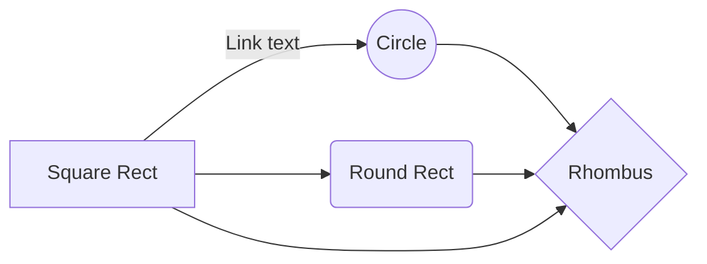

# Documentation

This is a pretty nice page
|  ***strong text***|  |
|--|--|
|  |  |
~~

## 

 - [ ] 

> 
|`strikethrough text`|  |
|------------------|--|
|                  |  |

~~
And this will produce a flow chart:

<!--stackedit_data:
eyJoaXN0b3J5IjpbLTE4NjcwMjA5ODBdfQ==
-->